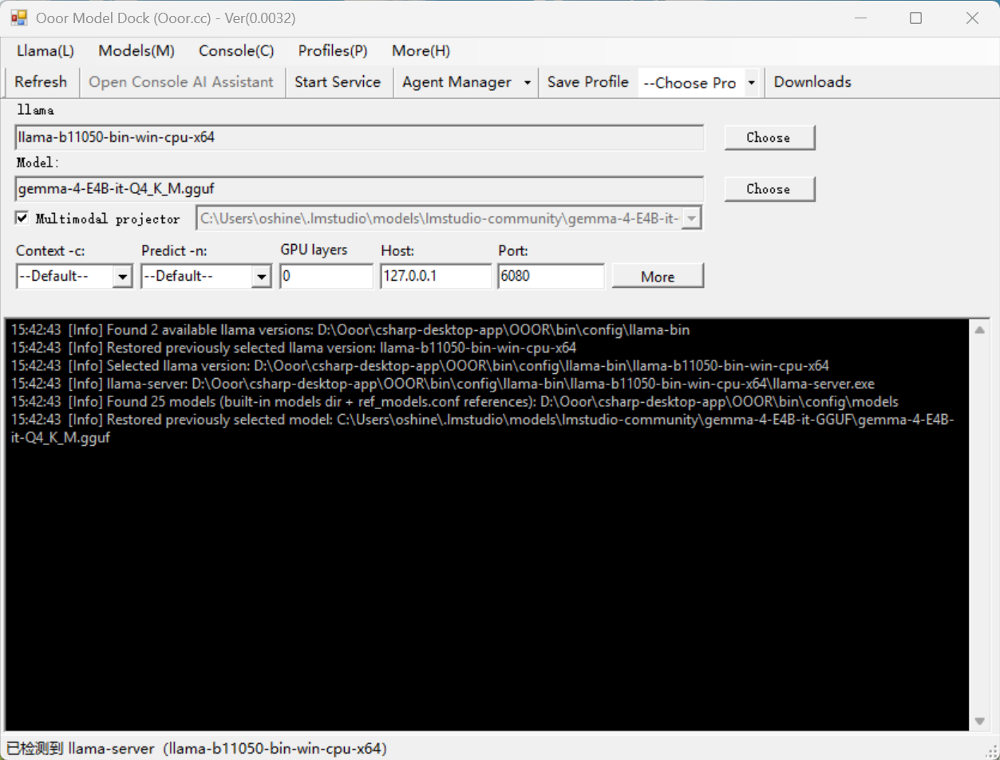
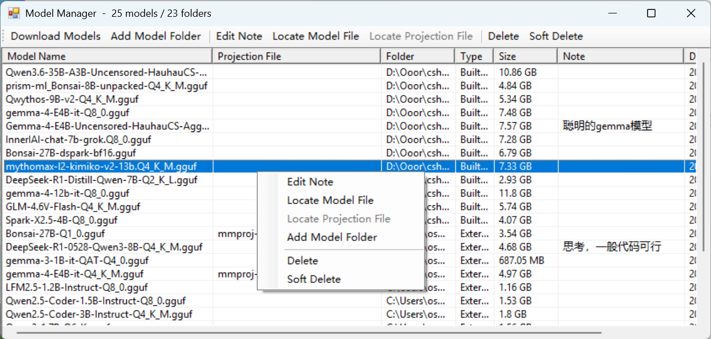
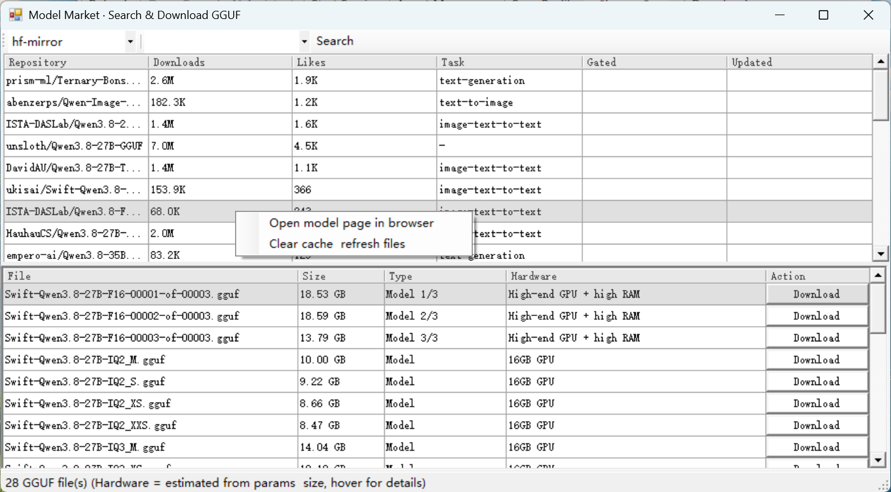
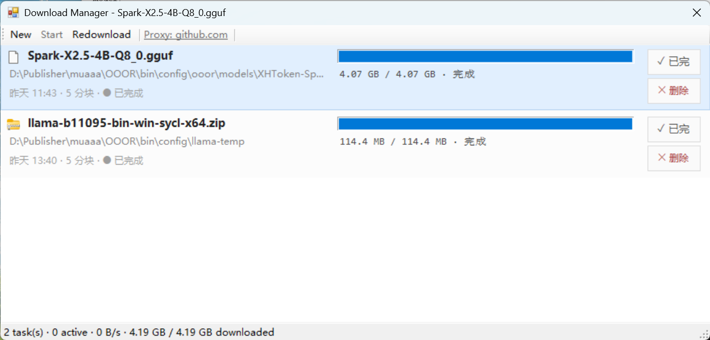

# Ooor — 本地大模型坞

> 一个为 **llama.cpp** 而生的轻量级 Windows 桌面应用：安装、管理、对话本地大模型。把运行时、模型库、下载器、聊天控制台与可调用工具的 Agent 层，全部塞进一个 **不到 1.5 MB** 的安装包里。

🌐 **官网：** [ooor.cc](https://ooor.cc)  ·  📦 **协议：** MIT  ·  🛠 **作者：** oshine

---

## 目录

- [程序截图](#程序截图)
- [Ooor 是什么](#ooor-是什么)
- [为什么选 Ooor](#为什么选-ooor)
- [核心特性](#核心特性)
- [安装](#安装)
- [快速上手](#快速上手)
- [功能详解](#功能详解)
- [内置工具（Agent 层）](#内置工具agent-层)
- [系统要求](#系统要求)
- [从源码构建](#从源码构建)
- [项目结构](#项目结构)
- [配置与路径](#配置与路径)
- [常见问题](#常见问题)
- [路线图](#路线图)
- [参与贡献](#参与贡献)
- [开源协议](#开源协议)
- [致谢](#致谢)

---

## 程序截图

| 主窗口：配置引擎与模型，实时查看控制台日志 | 模型管理器：本地 GGUF 模型库 |
|---|---|
|  |  |

| 模型市场：从 Hugging Face 镜像搜索下载 | 下载管理器：分块、断点续传、代理感知 |
|---|---|
|  |  |

---

## Ooor 是什么

**Ooor**（中文：欧尔模型坞，发音 "O-or"）是一个原生 Windows 桌面应用，把 **llama.cpp** 命令行生态封装成一个开箱即用、一键启动的工作台。它的目标用户是：希望在自己的硬件上跑大语言模型——离线、私密、不付云上账单——但又不想花一下午读 `llama-server --help` 的人。

具体来说，Ooor 把四种角色塞进一个极小的可执行文件里：

1. **Llama 运行时管理** —— 一键发现、安装、切换 `llama-server` 编译版本（CPU / CUDA / Vulkan / SYCL ……）。
2. **本地模型库** —— 给机器上的每个 `.gguf` 文件建目录、加备注、软删除、定位多模态投影文件。
3. **下载器** —— 分块、可断点续传的下载管理器，内置 Hugging Face 镜像支持与模型市场浏览器。
4. **聊天控制台与 Agent 宿主** —— 在内置控制台里跟正在跑的模型对话，并让它通过一层兼容 MCP 的工具调用，触达一组本地工具（抓网页、读写文件、跑 shell ……）。

这一切被打包进一个 **不到 1.5 MB** 的安装包。没有 Electron，没有捆绑 Node 运行时，没有 200 MB 的框架下载——只是一个手工编写的 WinForms 二进制，通过本地 HTTP API 直接跟 `llama-server.exe` 对话。

---

## 为什么选 Ooor

本地大模型工具圈已经挺挤了。下面是选 Ooor 的理由：

### 极致小巧
绝大多数"本地 AI"GUI 都是 Electron 应用，拖着一整个 Chromium 实例跑。Ooor 是单一原生二进制——安装包 **~1.5 MB**，冷启动几乎瞬时，空闲内存只占个位数 MB。如果你曾经因为某个"轻量"LLM GUI 啃掉 800 MB 内存却只是挂在那儿而把它关掉，Ooor 就是来反驳的。

### 默认即隐私
模型跑在 `127.0.0.1`。除非你明确让 Agent 去抓某个 URL，否则什么都不会离开你的机器。没有遥测，没有"匿名使用统计"，没有账号。你的提示词、你的文件、你的事。

### 有主张，不是空画布
像 `llama.cpp` 的命令行、`text-generation-webui`、`LM Studio` 这类工具，把每个旋钮都暴露给你。这种自由很好——也很累。Ooor 替你挑好合理默认值（Q4_K_M、本机绑定、合理上下文长度），把几乎用不到的旋钮藏起来；真正常用的（GPU 层数、端口、多模态投影、额外服务参数）则放在 **More** 按钮后面。

### 一个应用，而不是五个
典型的本地 LLM 工作流要在四个工具之间来回切：模型浏览器（Hugging Face 网站）、下载器（`wget` / `aria2` / 一遇到 5 GB 文件就崩的浏览器）、模型整理器（资源管理器 + 拼运气）、运行器（`llama-server` + curl）。Ooor 把这四个角色压成一个窗口。下载管理器甚至认识 `llama-bXXXX-bin-win-*.zip` 归档，自动解压进运行时库。

### 面向 Agent
除了聊天，Ooor 还给正在跑的模型配了一个小工具箱——抓一个 URL、读一个文件、写一个文件、列目录、跑 shell 命令（带确认）。这把本地模型从"单轮问答盒"变成了更接近**本地编码与研究助手**的东西。

---

## 核心特性

- 🚀 **一键启动模型** —— 选好引擎与模型，按 **Start Service**，即可在 `127.0.0.1:6080` 拿到一个 OpenAI 兼容的 HTTP 端点。
- 📚 **本地模型库** —— 扫描内置与外部目录，显示大小 / 类型 / 投影文件 / 备注，支持软删除，便于在不重下的情况下重新导入。
- 🛒 **内置模型市场** —— 浏览 Hugging Face（走 `hf-mirror` 或直连），查看下载量 / 点赞 / 任务标签，右键直接在浏览器打开模型主页。
- ⬇️ **可断点续传的分块下载器** —— 多分块并行下载、自动重试、GitHub 代理镜像列表（对 GFW 用户尤其友好）、`llama-*.zip` 运行时自动解压。
- 💬 **控制台聊天** —— 对着正在跑的模型流式聊天，带 token 火花线与分块时序可视化。
- 🤖 **Agent 宿主** —— 把工具绑定到 Agent，由模型决定何时调用；破坏性操作带人工确认环节。
- 🔌 **MCP 友好** —— 扫描并绑定 Model Context Protocol 服务端，与内置工具目录并列使用。
- 🌐 **多语言界面** —— 英语与简体中文，运行时可切换。
- 🧩 **配置档案** —— 把"引擎 + 模型 + 参数 + Agent 绑定"存成命名档案，一键切换上下文。
- 🪶 **~1.5 MB 安装包** —— 带签名、带卸载器、带可选的用户数据清理。

---

## 安装

1. 从 [ooor.cc 的发布页](https://ooor.cc)下载最新的 `Ooor-Setup-x64-v*.exe`。
2. 双击运行。Windows 首次可能弹出"未知发布者"提示——这对自签名构建属于正常现象，点 **仍要运行** 即可（商业代码签名证书已在路线图上）。
3. 安装器会选一个合理的默认目录（有 D 盘就 `D:\Ooor`，否则 `%LOCALAPPDATA%\Ooor`），并自动建好数据目录：
   - `bin\`        —— 程序文件
   - `config\`     —— 用户数据（llama-bin、模型、配置、聊天记录）
4. 从开始菜单或桌面快捷方式启动 **Ooor**。

无需重启、无需装运行时、日常使用无需管理员权限（安装器本身仅因要写入安装目录而申请一次管理员）。

---

## 快速上手

1. **拿一个 llama 引擎。** 打开 **Llama → Downloads**（或工具栏的 **Downloads** 按钮），下一个 `llama-bXXXX-bin-win-cpu-x64.zip`（或匹配你硬件的 CUDA/Vulkan/SYCL 变体）。Ooor 会自动解压到 `config\llama-bin\` 并自动选中。
2. **拿一个模型。** 打开 **Models → Download Models**（或模型市场）。先挑个小号练手，比如 `Qwen2.5-Coder-1.5B-Instruct-Q4_K_M`，点 **Download**。
3. **启动服务。** 回到主窗口，引擎与模型都已自动预选。点 **Start Service**。控制台会打印 `llama-server` 启动日志，状态栏显示 `已检测到 llama-server`。
4. **开聊。** 点 **Open Console AI Assistant**，输入一句话，模型流式回话。
5. **上 Agent。** 打开 **Agent Manager**，绑定几个工具（比如 *Fetch URL*、*Read File*），存成档案，然后让模型做一件需要工具的事——比如 *"总结一下 https://github.com/.../README.md 这个 README"*。

整套闭环就这些。其余都是打磨。

---

## 功能详解

### 1. Llama 引擎管理

Ooor 自己不带推理引擎——它管理的是 `llama.cpp` 官方发布的二进制构建。主窗口的 **llama** 输入框显示当前选中的构建（截图里是 `llama-b11050-bin-win-cpu-x64`），**Choose** 让你在 `config\llama-bin\` 下的所有构建之间切换。新构建频繁出现在 `llama.cpp` 的 GitHub Releases；Ooor 的下载器知道怎么找到它们、按你的架构下到对应的 zip、直接落到运行时目录。

为什么这样设计：`llama.cpp` 迭代极快，几个月间隔的构建在性能与支持的模型格式上可能差异巨大。把引擎与 GUI 解耦，意味着你能只升引擎不升 Ooor，反过来也一样。

### 2. 本地模型库

**Model Manager** 窗口（`Models` 菜单）就是你机器上 `.gguf` 文件的电子表格。列包括：

- **Model Name** —— 文件名
- **Projection File** —— 多模态（视觉）模型对应的 `mmproj-*.gguf`，若有
- **Folder** —— 磁盘上的位置
- **Type** —— *Built-in*（`config\models` 下）或 *External*（你引用的某个外部目录，比如 LM Studio 的库）
- **Size** —— 占用磁盘
- **Note** —— 你随手写的标注（比如 *"聪明的 gemma 模型"*、*"代码还行"*）
- **D** —— 软删除标记

右键一行有上下文菜单：改备注、定位文件、定位投影、加模型目录、硬删、软删。软删会把它从列表里挪走但磁盘文件保留——这对"试一批模型、又不想以后再下 7 GB"的场景非常顺手。

### 3. 模型市场

**Model Market** 窗口（`Models → Download Models`）是一个为 GGUF 调过味的 Hugging Face 浏览器。选个镜像（默认 `hf-mirror`），你会得到一张可排序的仓库表：下载量、点赞、任务分类、是否 gated、最后更新时间。点一个仓库，会列出它发布的每个 `.gguf` 文件，并在每个量化变体旁标注估计的硬件要求（比如 *"16 GB GPU"*、*"高端 GPU + 大内存"*）。需要完整 HF 页面时，右键 → *在浏览器中打开模型页面*。

这对直连 Hugging Face 不稳定的地区特别有用——镜像选择器加上代理感知的下载器，让 10 GB 的模型拉取变得没那么煎熬。

### 4. 下载管理器

**Download Manager** 是个真正的下载管理器，而不是装样子的进度条。每个文件展示：

- 保存路径、总大小、已完成大小
- 分块数量（多分块并行下载）
- 每块的完成状态点
- 开始 / 重新下载 / 删除
- 时间戳

状态栏汇总任务数、活跃数、当前速度、总字节数。下载可断点续传——中途关掉应用，重开点 **Start**，分块从断点继续。下载器还会自动识别 `llama-b*-bin-win-*.zip` 归档并解压到 `config\llama-bin\`，下载一完成引擎即可用。

### 5. 聊天控制台

**Open Console AI Assistant** 拉起一个对着正在跑的模型的流式聊天视图。每个助手回合都会显示 token 火花线（随时间的每秒分块数）与每块时序——不用单独跑基准就能横向对比引擎构建或量化方案。聊天记录按档案本地持久化。

### 6. Agent 宿主与工具调用

**Agent Manager**（`Llama` 菜单或工具栏）让你定义一个 Agent：系统提示词、绑定的工具集合、可选的 MCP 服务端。当模型判断需要调用工具时，控制台会展示调用过程，破坏性工具还会在执行前向你确认。这一层让 Ooor 从"聊天盒"升级为"本地助手"。

### 7. 配置档案

**Profile** 是"引擎 + 模型 + 运行参数 + Agent 绑定"的快照。工具栏 **Save Profile** 存下当前设置，从下拉框切换档案。典型用法：一个档案留给快问快答的小模型，另一个留给做重构的大号编码模型。

---

## 内置工具（Agent 层）

内置工具目录让模型能安全、有边界地触达本地机器与网络。要点：

- **Fetch URL** —— HTTP GET 一个 URL，把清洗后的文本/markdown 返回给模型。当目标是 `github.com` / `raw.githubusercontent.com` 时，会套用 GitHub 代理镜像列表。
- **Read File** —— 从允许的根目录读一个文本文件。
- **Write File** —— 向允许的根目录写文本（需确认）。
- **List Directory** —— 列出目录下的文件。
- **Shell** —— 跑一条 shell 命令（需确认，输出流式回灌给模型）。
- **Memory** —— 跨轮笔记的简易键值存储。

工具按模型原生的函数调用格式暴露；不支持原生函数调用的引擎，Ooor 会退化为基于解析的调用格式。通过 Agent Manager 绑定的 MCP 服务端，与内置工具并列地暴露给模型。

---

## 系统要求

- **操作系统：** Windows 10 1809+ / Windows 11（x64）。暂无 macOS/Linux 构建。
- **运行时：** .NET Framework 4.8（Win10 1903+ 与 Win11 已预装）。
- **内存：** 最小模型 4 GB 空闲；7B 级 Q4 模型 16 GB+；13B+ 32 GB+。
- **GPU：** 可选。CPU 推理什么机器都行；要 GPU offload，选匹配硬件的 `llama-b*-win-cuda` / `-vulkan` / `-sycl` 构建，并在主窗口调高 **GPU layers**。
- **磁盘：** 程序本体安装后约 5 MB；模型（每个 1–15 GB）与运行时（每个 ~100 MB）请另行预算。

---

## 从源码构建

需要 Windows + Visual Studio 2022（或 Build Tools）带 **.NET 桌面工作负载**，安装器打包需要 **NSIS 3.x** 在 `%PATH%` 中，可选 **signtool**（Windows SDK）做代码签名。

```bash
git clone https://github.com/<your-org>/ooor.git
cd ooor
```

构建由一个 Node 脚本驱动，负责版本自增、MSBuild 调用、NSIS 打包、代码签名：

```bash
node ooor-utils/desktop-app/build-all.js
```

脚本依次执行：

1. 读 `Core/DEF.cs` 的 `ver`，加 `0.0001` 写回。
2. 同步新版本号到 `Properties/AssemblyInfo.cs` 与 `app/installer.nsi`。
3. 清空 `bin/Release/` 并跑 MSBuild（`/p:Configuration=Release`）。
4. 把运行时 `github-proxy.txt` 复制进 config 目录树。
5. 用 `signtool` 给 `ooor.exe` 签名（没提供 `.pfx` 就自动生成自签名证书）。
6. 跑 `makensis` 产出 `app/out/ooor-Setup-x64-v<ver>.exe`。
7. 给安装包签名。

C# 工程位置通过 `ooor-utils/desktop-app/.env` 可配：

```
RELATIVE_MAIN_DIR = ./csharp-desktop-app/OOOR
```

该路径相对仓库根（即 `desktop-app/` 向上两级）解析。不配则退回旧布局。

要做端到端发布自动化（构建 → 上传 → 版本列表 → 更新检查），用：

```bash
node ooor-utils/desktop-app/publish.js build_and_upload --notes "你的发版日志"
```

完整命令面（upload / list / latest / download / delete / 代理管理 / 健康检查）见 `publish.js --help`。

---

## 项目结构

```
csharp-desktop-app/
├── OOOR/                       # 桌面应用主体（本 README 所属工程）
│   ├── Core/                   # 领域逻辑：引擎运行时、模型存储、Agent、工具
│   ├── Controls/               # 自定义 WinForms 控件（火花线、不自动滚面板 ……）
│   ├── Properties/             # AssemblyInfo、Resources.resx
│   ├── html/                   # 聊天控制台内嵌的 Web 资源（index.html、vue.js ……）
│   ├── Lang/                   # 国际化字符串（en.json、zh.json）
│   ├── Ooor.csproj
│   └── Program.cs
├── Ooor-cli/                   # 可选的命令行前端
├── OoorFunc/                   # 共享的 Agent/工具函数库
├── ooor-sqlite-mcp/            # 示例 SQLite MCP 服务端
├── doc/img/                    # 本 README 引用的截图
└── Ooor.slnx                   # 列出全部 C# 工程的解决方案
```

---

## 配置与路径

Ooor 是数据驱动的，所有用户可写的内容都落在同一棵 config 目录树下，备份与迁移都很省心。

| 路径 | 用途 |
|---|---|
| `<安装>\bin\Ooor.exe` | 应用本体 |
| `<安装>\config\llama-bin\` | 解压好的 `llama-server` 构建 |
| `<安装>\config\models\` | 内置模型目录（自动扫描） |
| `<安装>\config\github-proxy.txt` | 下载器使用的 GitHub 加速镜像列表 |
| `<安装>\config\ref_models.conf` | 外部模型目录引用（比如 LM Studio 库） |
| `<安装>\config\`（chat/temp/remark） | 聊天记录、临时、备注 |

默认 `<安装>` 在有 D 盘时为 `D:\Ooor`，否则 `%LOCALAPPDATA%\Ooor`。安装器通过注册表记住上一次的安装位置，升级时复用。

---

## 常见问题

**我的数据会被发到任何地方吗？**  
不会。模型服务绑定在 `127.0.0.1`。仅当你主动让 Agent 抓某个 URL，或主动下载模型/引擎时，才会有出站流量。无遥测。

**能用非 Hugging Face 的模型吗？**  
能。把任意 `.gguf` 丢进 `config\models\`，或在模型管理器里用 *Add Model Folder* 引用一个外部目录——Ooor 都会收录。

**支持 GPU 吗？**  
支持——在引擎选择器里挑一个 GPU 版的 `llama-server`（`cuda` / `vulkan` / `sycl`），然后在主窗口调高 **GPU layers**。Vulkan 跨厂商兼容性最好。

**为什么用 WinForms 而不是 Electron/WPF/MAUI？**  
WinForms 启动快、体积极小、跟原生 Win32 通信不啰嗦。Ooor 的全部意义就是"小而原生"；改成 Electron 就背叛了这个初衷。

**为什么安装包用自签名证书？**  
商业 EV 代码签名证书很贵，目前由作者自掏腰包。构建脚本支持通过 `app/.env`（`OOOR_SIGN_PFX` / `OOOR_SIGN_PASSWORD`）直接换上真正的 `.pfx`——赞助一张证书是受欢迎的。

**会有 macOS/Linux 版吗？**  
短期内不会。`llama.cpp` 跨平台，但 GUI 是 WinForms。基于 Web 的控制台在路线图上。

---

## 路线图

- ✅ Llama 引擎管理
- ✅ 本地模型库
- ✅ Hugging Face 市场浏览器
- ✅ 可断点续传的下载器
- ✅ 流式聊天控制台
- ✅ 内置工具目录 + Agent 宿主
- ✅ MCP 服务端绑定
- 🚧 商业代码签名证书
- 🚧 跨引擎支持（不止 `llama.cpp`）
- 🚧 RAG / 本地知识库
- 🚧 自定义工具的插件 SDK
- 🚧 远程（非本机）模式 + 鉴权

---

## 参与贡献

欢迎贡献——bug 报告、功能想法、UI 打磨、翻译修正、文档都算。开大型 PR 前，请先开 issue 讨论方向。

几条值得知道的约定：

- 项目偏好**独立的 WinForms 窗口**而非系统提供的标准对话框，以获得更好的自定义空间。
- 业务逻辑放在 **`Core/` 领域类**里，不塞进 UI 层。
- 新工具集成优先**HTTP 化**；只在 HTTP 版本稳定后再考虑 WebSocket。
- 做优化时，偏好**最小改动**——项目珍视小体积与可读的代码。

---

## 开源协议

基于 **MIT 协议**发布。完整文本见 [LICENSE](LICENSE)。

```
MIT License

Copyright (c) 2026 oshine

Permission is hereby granted, free of charge, to any person obtaining a copy
of this software and associated documentation files (the "Software"), to deal
in the Software without restriction, including without limitation the rights
to use, copy, modify, merge, publish, distribute, sublicense, and/or sell
copies of the Software, and to permit persons to whom the Software is furnished
to do so, subject to the following conditions:

The above copyright notice and this permission notice shall be included in all
copies or substantial portions of the Software.

THE SOFTWARE IS PROVIDED "AS IS", WITHOUT WARRANTY OF ANY KIND...
```

---

## 致谢

- **[llama.cpp](https://github.com/ggerganov/llama.cpp)** 项目——没有它就没有这一切。
- **Hugging Face** 社区，以及 **`hf-mirror`** 的维护者，让模型获取更公平。
- 每一位模型作者——他们的权重最终落进了某个 `config\models\` 文件夹。
- 微软的 WinForms 与 .NET Framework 团队——一个还能让 1.5 MB 二进制在 2026 年的裸装 Windows 上跑起来的运行时。

---

<p align="center">由 <a href="https://ooor.cc">oshine</a> 出品 · <a href="https://ooor.cc">ooor.cc</a></p>
